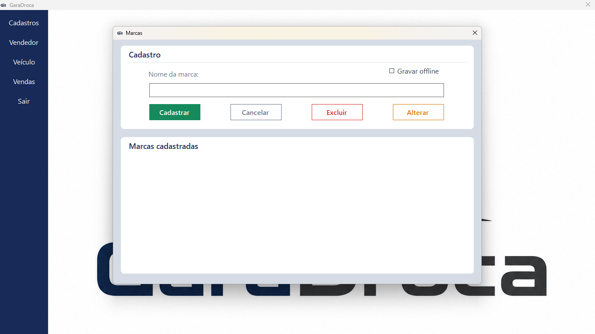
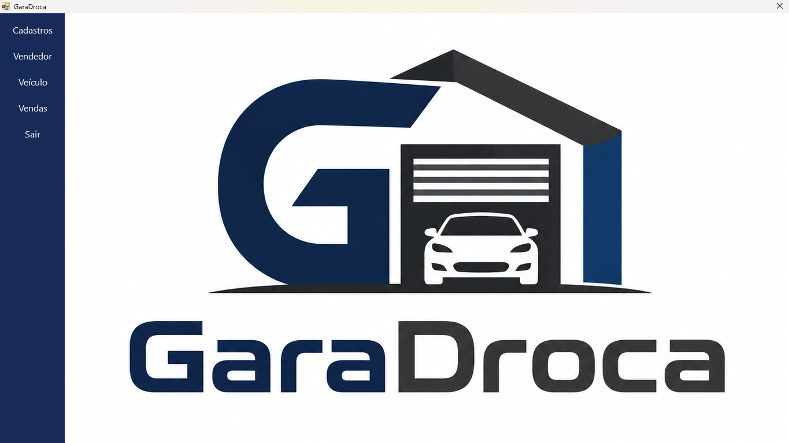
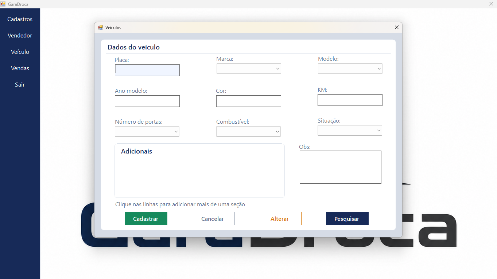

# GaraDroca

Sistema desktop (WinForms/C#) de gestão para garagem/concessionária de veículos, com cadastro de veículos, marcas, modelos, vendedores e controle de vendas.

## Funcionalidades

- Cadastro e consulta de veículos
- Cadastro de marcas e modelos
- Gestão de vendedores
- Acompanhamento de vendas
- Sistema de login

## Tecnologias

- C#
- Windows Forms
- SQL

## Telas

